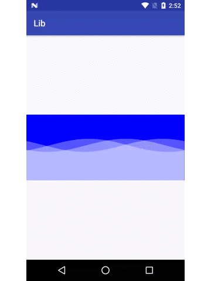

# WaveView

多条波纹的视图

#### 演示:



#### 使用：

##### Project build.gradle配置

```groovy
allprojects {
  repositories {
    ...
    maven { url 'https://jitpack.io' }
  }
}
```

##### Module build.gradel配置

```groovy
dependencies {
        compile 'com.github.Dean1990:WaveView:-SNAPSHOT'
}
```

##### 布局

```xml
<com.deanlib.waveview.WaveView
            android:id="@+id/waveView"
            android:layout_width="match_parent"
            android:layout_height="150dp"
            wave:number="3"
            wave:peakValue="15dp"
            wave:speed="10"
            wave:speedDValue="6"
            wave:waveColor="#66ffffff"
            wave:waveHeight="80dp" />
```

##### 布局文件可设置参数说明：

| 参数名              | 说明                                       | 默认值             |
| ---------------- | ---------------------------------------- | --------------- |
| wave:number      | 波纹数量                                     | 1（数量不要太大，手机受不了） |
| wave:peakValue   | 震幅（控制波浪高度）                               | 30dp            |
| wave:speed       | 波纹标准速度                                   | 5               |
| wave:speedDValue | 波纹之间速度差                                  | 2               |
| wave:waveColor   | 波纹颜色，应设置半透明色，以实现叠层效果                     | 0x881E90FF（蓝色）  |
| wave:waveHeight  | 波纹高度（波纹部分在视图中高度，需要 android:layout_height的配合，理论上讲 android:layout_height的高度应该大于等于wave:waveHeight+wave:peakValue/2才能完整显示波纹，形象的描述：wave:waveHeight变大意味着涨潮了） | 100dp           |

##### 代码设置

```java
WaveView mWaveView = findViewById(R.id.waveView);
mWaveView.setAnim(true);
//开启波纹或者
mWaveView.setAnim(false);
//默认是开启的
```

#### Demo:

[https://github.com/Dean1990/LibDemo](https://github.com/Dean1990/LibDemo)
